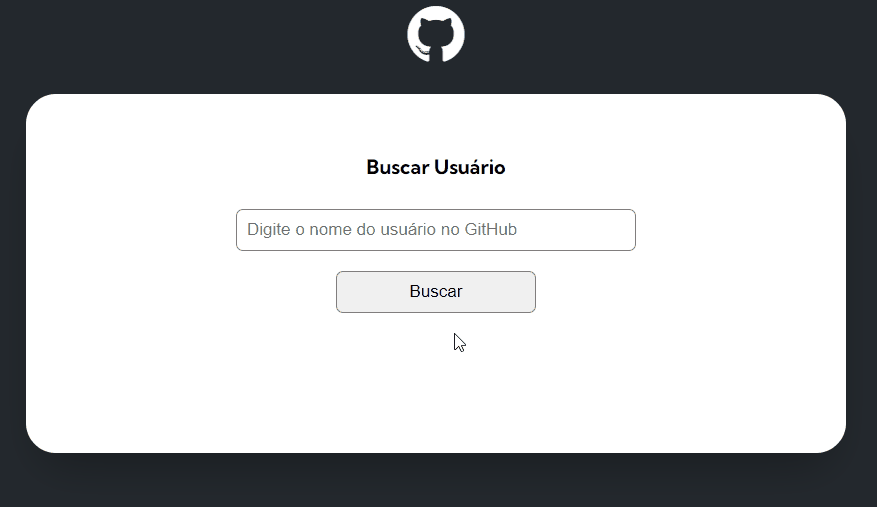

# Projeto Fetch GitHub API com JS

## Objetivo

- Construir um projeto em HTML, CSS e JavaScript que recebe como parâmetro um nome de usuário do GitHub e retorna os seus dados de repositórios e seus últimos eventos.

## Screenshot

[]


## Tecnologias utilizadas

- HTML;
- CSS;
- Javascript

### O que aprendi

 - Posicionar os elementos na tela;
 - Utilizar fontes externas
 - Trabalahar com as propriedades do Display Flex;
 - Manipular o DOM através do JS;
 - Construir funções em JS;
 - Consumir uma API com o método fetch;
 - Trabalhar com o InnerHTML.


### Como utilizar

1 - Clone para o projeto

```
git@github.com:ederhscc/projeto-fetch-github-api.git
```